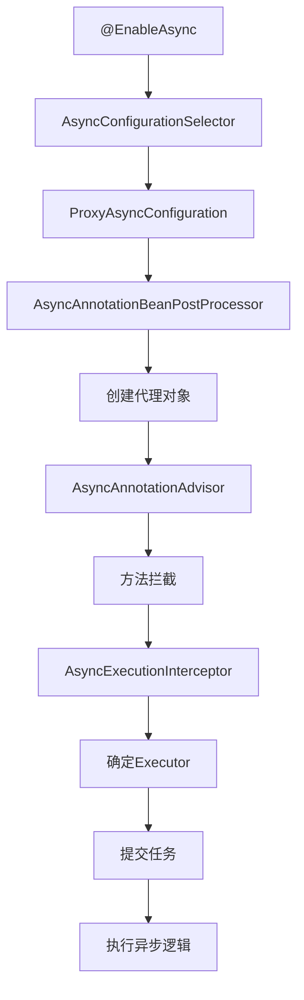
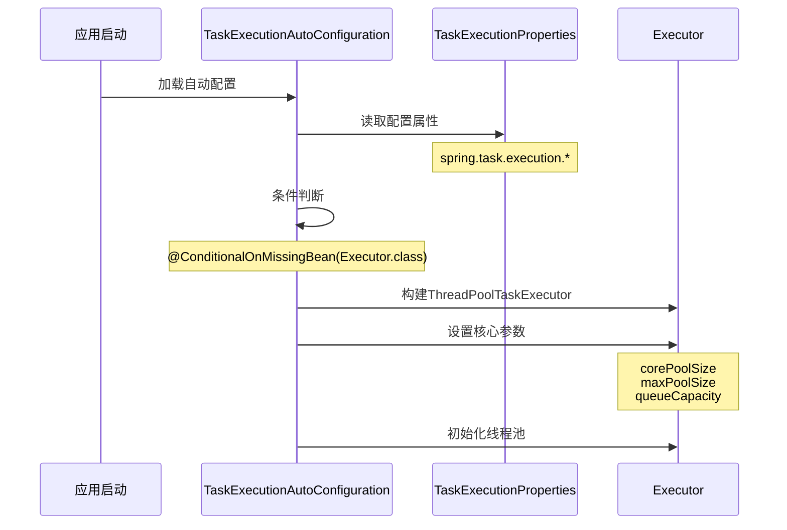
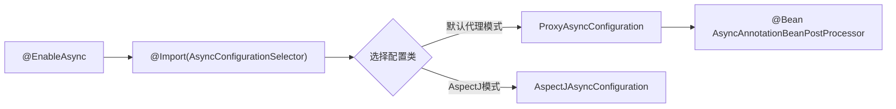
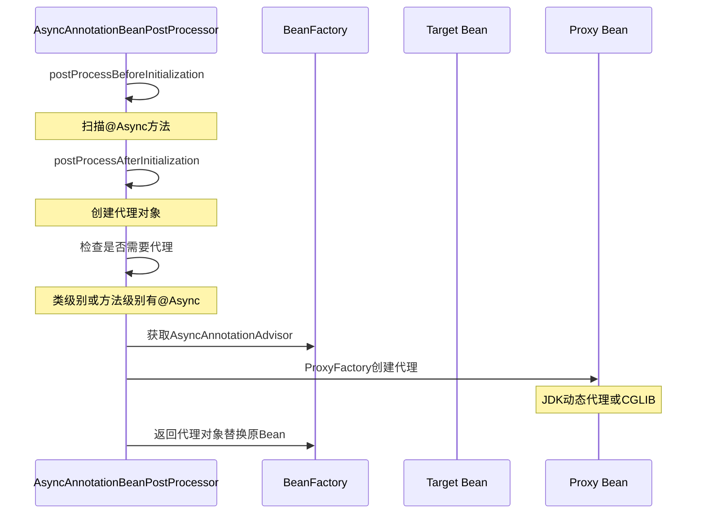
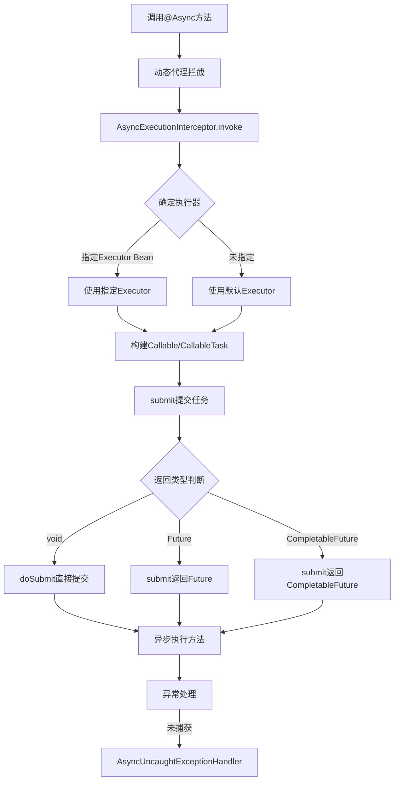

# # Spring Boot 异步任务实现原理完整解析

## 一、整体架构概览



## 二、详细实现流程

### 1. 自动配置阶段



**关键配置类：**
```java
@Configuration
@ConditionalOnClass(ThreadPoolTaskExecutor.class)
@EnableConfigurationProperties(TaskExecutionProperties.class)
public class TaskExecutionAutoConfiguration {

    @Bean
    @ConditionalOnMissingBean
    public TaskExecutorBuilder taskExecutorBuilder(TaskExecutionProperties properties) {
        // 构建器模式创建Executor
    }

    @Bean
    @ConditionalOnMissingBean(Executor.class)
    public ThreadPoolTaskExecutor applicationTaskExecutor(TaskExecutorBuilder builder) {
        return builder.build();
    }
}
```

### 2. @EnableAsync 注解处理



**关键源码分析：**
```java
@Import(AsyncConfigurationSelector.class)
public @interface EnableAsync {
    AdviceMode mode() default AdviceMode.PROXY;  // 默认JDK/CGLIB代理
    Class<? extends Annotation> annotation() default Annotation.class;
    boolean proxyTargetClass() default false;     // CGLIB代理开关
}
```

### 3. AsyncAnnotationBeanPostProcessor 初始化

```java
public class ProxyAsyncConfiguration extends AbstractAsyncConfiguration {

    @Bean(name = TaskManagementConfigUtils.ASYNC_ANNOTATION_PROCESSOR_BEAN_NAME)
    public AsyncAnnotationBeanPostProcessor asyncAdvisor() {
        AsyncAnnotationBeanPostProcessor bpp = new AsyncAnnotationBeanPostProcessor();

        // 设置配置的executor
        bpp.setExecutor(this.executor);

        // 设置异常处理器
        bpp.setExceptionHandler(this.exceptionHandler);

        // 设置代理目标类（CGLIB）
        bpp.setProxyTargetClass(this.proxyTargetClass);

        // 设置执行顺序
        bpp.setOrder(this.order);

        return bpp;
    }
}
```

### 4. Bean 后处理器工作流程



**核心方法：**
```java
public class AsyncAnnotationBeanPostProcessor extends AbstractBeanFactoryAwareAdvisingPostProcessor {

    @Override
    public Object postProcessAfterInitialization(Object bean, String beanName) {
        if (isEligible(bean, beanName)) {
            // 创建代理
            ProxyFactory proxyFactory = prepareProxyFactory(bean, beanName);
            proxyFactory.addAdvisor(this.advisor);
            return proxyFactory.getProxy(getProxyClassLoader());
        }
        return bean;
    }

    // 判断是否需要代理
    protected boolean isEligible(Class<?> targetClass) {
        // 查找类或方法上的@Async注解
        return AnnotationUtils.findAnnotation(targetClass, Async.class) != null
               || hasAsyncMethods(targetClass);
    }
}
```

### 5. 通知链（Advisor）初始化

```java
public class AsyncAnnotationAdvisor extends AbstractPointcutAdvisor implements BeanFactoryAware {

    private Advice advice;          // 拦截逻辑
    private Pointcut pointcut;      // 切入点匹配

    public AsyncAnnotationAdvisor(
            @Nullable Supplier<Executor> executor,
            @Nullable Supplier<AsyncUncaughtExceptionHandler> exceptionHandler) {

        // 构建通知
        this.advice = buildAdvice(executor, exceptionHandler);

        // 构建切入点（匹配@Async注解的方法）
        this.pointcut = buildPointcut();
    }

    protected Advice buildAdvice() {
        AnnotationAsyncExecutionInterceptor interceptor =
            new AnnotationAsyncExecutionInterceptor(null);
        interceptor.configure(executor, exceptionHandler);
        return interceptor;
    }
}
```

### 6. 方法拦截与异步执行



**核心拦截器：**
```java
public class AsyncExecutionInterceptor extends AsyncExecutionAspectSupport
    implements MethodInterceptor, Ordered {

    @Override
    public Object invoke(MethodInvocation invocation) throws Throwable {
        // 1. 确定使用的Executor
        Executor executor = determineAsyncExecutor(invocation.getMethod());

        // 2. 包装为Callable
        Callable<Object> task = () -> {
            try {
                Object result = invocation.proceed();
                if (result instanceof Future) {
                    return ((Future<?>) result).get();
                }
            } catch (Throwable ex) {
                handleError(ex, invocation.getMethod());
            }
            return null;
        };

        // 3. 提交异步任务
        return doSubmit(task, executor, invocation.getMethod().getReturnType());
    }
}
```

**确定执行器的优先级：**
```java
protected Executor determineAsyncExecutor(Method method) {
    Executor executor;

    // 1. 方法级别的@Async("executorName")
    Async async = method.getAnnotation(Async.class);
    if (async != null && StringUtils.hasText(async.value())) {
        executor = beanFactory.getBean(async.value(), Executor.class);
        return executor;
    }

    // 2. 类级别的@Async
    async = method.getDeclaringClass().getAnnotation(Async.class);
    if (async != null && StringUtils.hasText(async.value())) {
        executor = beanFactory.getBean(async.value(), Executor.class);
        return executor;
    }

    // 3. 默认executor
    return getDefaultExecutor();
}
```

### 7. 任务提交策略

```java
protected Object doSubmit(Callable<Object> task, AsyncTaskExecutor executor,
                         Class<?> returnType) {

    // 根据返回类型选择提交方式
    if (CompletableFuture.class.isAssignableFrom(returnType)) {
        return CompletableFuture.supplyAsync(() -> {
            try { return task.call(); }
            catch (Throwable ex) { throw new CompletionException(ex); }
        }, executor);
    }
    else if (ListenableFuture.class.isAssignableFrom(returnType)) {
        return ((AsyncListenableTaskExecutor) executor).submitListenable(task);
    }
    else if (Future.class.isAssignableFrom(returnType)) {
        return executor.submit(task);
    }
    else {
        // void 返回类型
        executor.submit(task);
        return null;
    }
}
```

## 三、完整流程图

```mermaid
flowchart TD
    Start([应用启动]) --> AutoConfig[TaskExecutionAutoConfiguration<br/>自动配置线程池]
    AutoConfig --> ConfigThreadPool[配置ThreadPoolTaskExecutor<br/>核心线程/最大线程/队列]
    ConfigThreadPool --> EnableAsync["@"EnableAsync注解处理]

    EnableAsync --> ImportSelector[AsyncConfigurationSelector<br/>选择配置模式]
    ImportSelector --> ProxyConfig[ProxyAsyncConfiguration<br/>默认代理模式]

    ProxyConfig --> CreateBPP[创建AsyncAnnotationBeanPostProcessor]
    CreateBPP --> SetExecutor[设置Executor/ExceptionHandler]

    SetExecutor --> BeanInit[Bean初始化阶段]
    BeanInit --> ScanAsync["扫描@Async注解<br/>postProcessBeforeInitialization"]
    ScanAsync --> FindMethods{"找到@Async方法?"}

    FindMethods -->|是| NeedProxy[标记需要代理]
    FindMethods -->|否| NoProxy[无需代理]

    NeedProxy --> CreateProxy[postProcessAfterInitialization<br/>创建代理对象]
    CreateProxy --> AddAdvisor[添加AsyncAnnotationAdvisor]
    AddAdvisor --> ProxyFactory[ProxyFactory创建代理<br/>JDK动态代理/CGLIB]

    ProxyFactory --> ReplaceBean[代理对象替换原Bean]
    ReplaceBean --> AppReady[应用启动完成]
    NoProxy --> AppReady

    AppReady --> MethodCall["调用@Async方法"]
    MethodCall --> Intercept[代理拦截器拦截]
    Intercept --> DetermineExec[determineAsyncExecutor<br/>确定执行器]

    DetermineExec --> ExecPriority{执行器选择优先级}
    ExecPriority -->|1.方法注解指定| MethodExec[使用指定BeanName Executor]
    ExecPriority -->|2.类注解指定| ClassExec[使用类级别指定Executor]
    ExecPriority -->|3.默认| DefaultExec[使用默认Executor<br/>applicationTaskExecutor]

    MethodExec --> WrapTask[包装为Callable任务]
    ClassExec --> WrapTask
    DefaultExec --> WrapTask

    WrapTask --> DoSubmit[doSubmit提交任务]
    DoSubmit --> ReturnType{判断返回类型}

    ReturnType -->|CompletableFuture| CF[CompletableFuture.supplyAsync]
    ReturnType -->|Future| F[executor.submit]
    ReturnType -->|void| V[executor.submit<br/>return null]

    CF --> AsyncExecute[异步线程执行]
    F --> AsyncExecute
    V --> AsyncExecute

    AsyncExecute --> ExecuteMethod[执行目标方法]
    ExecuteMethod --> HandleException{是否有异常?}

    HandleException -->|有异常| AsyncExHandler[AsyncUncaughtExceptionHandler<br/>处理未捕获异常]
    HandleException -->|无异常| ReturnResult[返回结果]

    AsyncExHandler --> End([完成])
    ReturnResult --> End

    style Start fill:#e1f5fe
    style End fill:#e1f5fe
    style AutoConfig fill:#f3e5f5
    style EnableAsync fill:#f3e5f5
    style CreateBPP fill:#e8f5e8
    style CreateProxy fill:#e8f5e8
    style Intercept fill:#fff3e0
    style AsyncExecute fill:#fff3e0
```



## 四、关键配置示例

```yaml
spring:
  task:
    execution:
      pool:
        core-size: 8          # 核心线程数
        max-size: 16          # 最大线程数
        queue-capacity: 100   # 队列容量
        keep-alive: 60s       # 空闲线程存活时间
      thread-name-prefix: async-  # 线程名前缀
```

```java
@Configuration
@EnableAsync
public class AsyncConfig implements AsyncConfigurer {

    @Override
    public Executor getAsyncExecutor() {
        ThreadPoolTaskExecutor executor = new ThreadPoolTaskExecutor();
        executor.setCorePoolSize(10);
        executor.setMaxPoolSize(20);
        executor.setQueueCapacity(200);
        executor.setRejectedExecutionHandler(
            new ThreadPoolExecutor.CallerRunsPolicy());
        executor.initialize();
        return executor;
    }

    @Override
    public AsyncUncaughtExceptionHandler getAsyncUncaughtExceptionHandler() {
        return new SimpleAsyncUncaughtExceptionHandler();
    }
}
```

这就是 Spring Boot 异步任务的完整实现原理。核心是通过 `AsyncAnnotationBeanPostProcessor` 后处理器，为标注了 `@Async` 的 Bean 创建代理，在方法调用时通过 `AsyncExecutionInterceptor` 拦截，将任务提交到线程池异步执行。