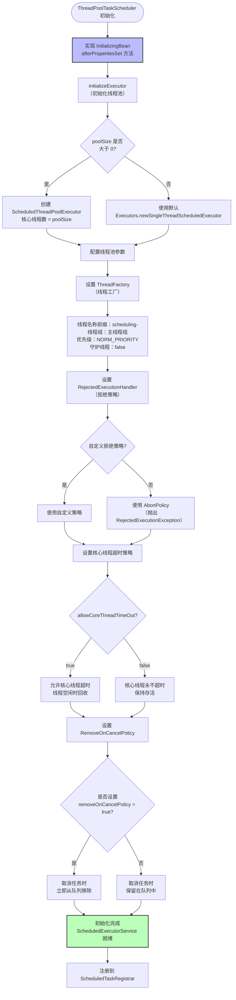
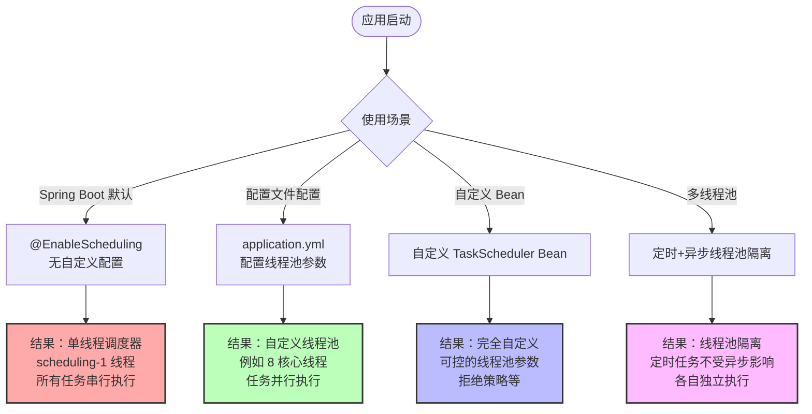

# Spring Boot 定时任务实现原理完整解析

## 目录

1. [核心组件概览](#核心组件概览)
2. [完整执行流程图](#完整执行流程图)
3. [初始化流程详解](#初始化流程详解)
4. [任务扫描与注册](#任务扫描与注册)
5. [调度器自动配置](#调度器自动配置)
6. [任务调度执行](#任务调度执行)
7. [FixedDelay 与 FixedRate 的区别](#fixeddelay-与-fixedrate-的区别)
8. [配置示例与最佳实践](#配置示例与最佳实践)
9. [总结](#总结)

---

## 核心组件概览

Spring Boot 定时任务主要涉及以下核心组件：

| 组件 | 作用 |
|------|------|
| `@EnableScheduling` | 启用定时任务功能 |
| `SchedulingConfiguration` | 注册核心处理器 |
| `ScheduledAnnotationBeanPostProcessor` | 核心后置处理器，扫描 @Scheduled 方法 |
| `TaskSchedulingAutoConfiguration` | Spring Boot 自动配置调度器 |
| `TaskSchedulingProperties` | 调度器配置属性 |
| `TaskSchedulerBuilder` | 调度器构建器 |
| `TaskScheduler` | 任务调度器接口 |
| `ThreadPoolTaskScheduler` | 默认调度器实现 |
| `ScheduledTaskRegistrar` | 任务注册器 |
| `ScheduledMethodRunnable` | 定时任务执行体 |
| `ReschedulingRunnable` | 可重新调度的任务包装器 |
| `ScheduledExecutorService` | 底层线程池 |

---

## 完整执行流程图

```mermaid
graph TB
    Start([Spring Boot 启动]) --> AutoConfig[Spring Boot 自动配置阶段]
    
    AutoConfig --> A["TaskSchedulingAutoConfiguration<br/>（定时任务自动配置类）"]
    
    A --> B{"@ConditionalOnBean<br/>@EnableScheduling?"}
    B -->|未启用| Skip[跳过定时任务配置]
    B -->|已启用| C[加载 TaskSchedulingAutoConfiguration]
    
    C --> D{"检查配置属性<br/>spring.task.scheduling.*"}
    D --> E{配置类型判断}
    
    E -->|有自定义配置| F["TaskSchedulingProperties<br/>读取配置属性"]
    E -->|无配置| G[使用默认配置]
    
    F --> H["解析线程池配置<br/>pool.core-size<br/>thread-name-prefix<br/>shutdown 等"]
    G --> I["默认线程池配置<br/>core-size=1<br/>thread-name-prefix=scheduling-"]
    
    H --> J[创建 TaskSchedulerBuilder]
    I --> J
    
    J --> K["TaskSchedulerBuilder.build<br/>构建调度器"]
    
    K --> L["创建 ThreadPoolTaskScheduler"]
    L --> M["initializeExecutor<br/>初始化线程池"]
    M --> N["创建 ScheduledThreadPoolExecutor"]
    
    N --> O["注册 TaskScheduler Bean<br/>到 Spring 容器"]
    
    O --> P["SchedulingConfiguration<br/>注册 ScheduledAnnotationBeanPostProcessor"]
    
    P --> Q[Bean 初始化阶段]
    Q --> R["postProcessAfterInitialization<br/>（Bean后置处理）"]
    
    R --> S{"扫描 Bean 中<br/>@Scheduled 方法"}
    S --> T["MethodIntrospector.selectMethods<br/>（查找注解方法）"]
    T --> U[解析 @Scheduled 注解属性]
    U --> V["createRunnable<br/>创建 ScheduledMethodRunnable"]
    
    V --> W{判断调度类型}
    W -->|Cron| X["解析 CronExpression<br/>创建 CronTrigger"]
    W -->|fixedDelay| Y["创建 FixedDelayTask"]
    W -->|fixedRate| Z["创建 FixedRateTask"]
    
    X --> AA[创建 CronTask]
    
    AA --> AB["ScheduledTaskRegistrar<br/>任务注册器"]
    Y --> AB
    Z --> AB
    
    AB --> AC{"TaskScheduler<br/>获取优先级"}
    AC --> AD["1. 查找名称='taskScheduler'的Bean"]
    AD --> AE{"是否找到?"}
    AE -->|是| AF["使用找到的<br/>TaskScheduler Bean"]
    AE -->|否| AG["2. 查找类型为<br/>TaskScheduler 的 Bean"]
    AG --> AH{"是否找到?"}
    AH -->|是| AF
    AH -->|否| AI["3. 查找 ScheduledExecutorService"]
    AI --> AJ{"是否找到?"}
    AJ -->|是| AK["包装为<br/>ConcurrentTaskScheduler"]
    AJ -->|否| AL["创建默认<br/>单线程调度器"]
    
    AF --> AM["ScheduledTaskRegistrar<br/>设置 TaskScheduler"]
    AK --> AM
    AL --> AM
    
    AM --> AN{"任务类型判断"}
    
    AN -->|CronTask| AO["创建 ReschedulingRunnable<br/>（可重新调度包装器）"]
    AN -->|FixedDelayTask| AP["executor.scheduleWithFixedDelay<br/>（固定延迟调度）"]
    AN -->|FixedRateTask| AQ["executor.scheduleAtFixedRate<br/>（固定频率调度）"]
    
    AO --> AR["ReschedulingRunnable.schedule<br/>开始调度"]
    AR --> AS["Trigger.nextExecutionTime<br/>计算下次执行时间"]
    AS --> AT{"下次执行时间<br/>是否为 null?"}
    AT -->|是| AU["任务结束<br/>（一次性任务）"]
    AT -->|否| AV["计算 initialDelay"]
    
    AV --> AW["executor.schedule<br/>提交延迟任务到线程池"]
    AP --> AW
    AQ --> AW
    
    AW --> AX["任务存入<br/>DelayedWorkQueue 延迟队列"]
    
    AX --> AY["ScheduledThreadPoolExecutor<br/>Worker 线程循环"]
    AY --> AZ["ThreadPoolExecutor.getTask<br/>从队列获取任务"]
    AZ --> BA{"队列中<br/>是否有到期任务?"}
    BA -->|否| BB["Worker 线程阻塞等待<br/>condition.awaitNanos(delay)"]
    BB --> BA
    
    BA -->|是| BC["取出到期任务<br/>Worker 线程执行"]
    
    BC --> BD["执行 ScheduledMethodRunnable.run<br/>反射调用目标方法"]
    
    BD --> BE{"执行是否<br/>抛出异常?"}
    BE -->|是| BF["ErrorHandler 处理<br/>（默认 LoggingErrorHandler）"]
    BE -->|否| BG["更新 TriggerContext<br/>记录执行时间"]
    
    BF --> BG
    BG --> BH{"判断任务<br/>是否已取消?"}
    BH -->|已取消| BI["任务终止"]
    BH -->|未取消| BJ{"任务类型?"}
    
    BJ -->|ReschedulingRunnable| BK["重新调用 schedule 方法<br/>计算下次执行时间"]
    BJ -->|FixedDelay| BL["等待 fixedDelay<br/>后自动重新调度"]
    BJ -->|FixedRate| BM["按固定频率<br/>自动重新调度"]
    
    BK --> AS
    BL --> AW
    BM --> AW
    
    BI --> BN["从 scheduledTasks<br/>中移除任务引用"]
    
    subgraph "Spring Boot 自动配置"
        A
        C
        D
        F
        H
        M
        N
        O
    end
    
    subgraph "任务扫描与注册"
        R
        S
        U
        V
        W
        AB
    end
    
    subgraph "调度器选择"
        AC
        AD
        AE
        AF
        AL
    end
    
    subgraph "任务执行与重新调度"
        AW
        AX
        AY
        BC
        BD
        BK
    end
    
    style A fill:#f9f,stroke:#333,stroke-width:4px
    style O fill:#bfb,stroke:#333,stroke-width:2px
    style R fill:#bbf,stroke:#333,stroke-width:2px
    style BD fill:#fbb,stroke:#333,stroke-width:2px
    style BF fill:#faa,stroke:#333,stroke-width:2px
```



---

## 初始化流程详解

### 1. 启用定时任务

```java
@SpringBootApplication
@EnableScheduling  // 1. 启用定时任务
public class Application {
    public static void main(String[] args) {
        SpringApplication.run(Application.class, args);
    }
}

// 2. @EnableScheduling 导入配置类
@Import(SchedulingConfiguration.class)
public @interface EnableScheduling {
}
```

### 2. 注册核心处理器

```java
@Configuration
public class SchedulingConfiguration {
    
    // 3. 注册 ScheduledAnnotationBeanPostProcessor
    @Bean(name = TaskManagementConfigUtils.SCHEDULED_ANNOTATION_PROCESSOR_BEAN_NAME)
    @Role(BeanDefinition.ROLE_INFRASTRUCTURE)
    public ScheduledAnnotationBeanPostProcessor scheduledAnnotationProcessor() {
        return new ScheduledAnnotationBeanPostProcessor();
    }
}
```

### 3. BeanPostProcessor 初始化

```java
public class ScheduledAnnotationBeanPostProcessor 
    implements ScheduledTaskHolder, MergedBeanDefinitionPostProcessor, 
               DestructionAwareBeanPostProcessor, ApplicationContextAware {
    
    // 4. 初始化调度器
    @Override
    public void setApplicationContext(ApplicationContext applicationContext) {
        this.applicationContext = applicationContext;
        if (this.beanFactory == null) {
            this.beanFactory = applicationContext;
        }
    }
    
    // 5. 关键初始化方法
    protected void onApplicationEvent(ContextRefreshedEvent event) {
        if (event.getApplicationContext() == this.applicationContext) {
            finishRegistration();  // 完成注册
        }
    }
}
```

---

## 任务扫描与注册

### 1. 扫描 @Scheduled 方法

```java
// ScheduledAnnotationBeanPostProcessor 核心方法
@Override
public Object postProcessAfterInitialization(Object bean, String beanName) {
    if (bean instanceof AopInfrastructureBean || 
        bean instanceof TaskScheduler || 
        bean instanceof ScheduledExecutorService) {
        return bean;  // 忽略基础设施 Bean
    }
    
    Class<?> targetClass = AopProxyUtils.ultimateTargetClass(bean);
    
    // 6. 扫描目标类中的 @Scheduled 方法
    Map<Method, Set<Scheduled>> annotatedMethods = 
        MethodIntrospector.selectMethods(targetClass,
            (MethodIntrospector.MetadataLookup<Set<Scheduled>>) method -> {
                Set<Scheduled> scheduledAnnotations = AnnotatedElementUtils
                    .getMergedRepeatableAnnotations(method, Scheduled.class, Schedules.class);
                return (!scheduledAnnotations.isEmpty() ? scheduledAnnotations : null);
            });
    
    if (annotatedMethods.isEmpty()) {
        return bean;
    }
    
    // 7. 处理每个标注了 @Scheduled 的方法
    annotatedMethods.forEach((method, scheduledAnnotations) ->
        scheduledAnnotations.forEach(scheduled -> 
            processScheduled(scheduled, method, bean)));
    
    return bean;
}
```

### 2. 创建并注册任务

```java
// 8. 处理单个定时任务
protected void processScheduled(Scheduled scheduled, Method method, Object bean) {
    try {
        // 创建可执行任务
        Runnable runnable = createRunnable(bean, method);
        
        // 收集所有需要调度的任务
        Set<ScheduledTask> tasks = new LinkedHashSet<>(4);
        
        // 9. 解析 cron 表达式
        String cron = scheduled.cron();
        if (StringUtils.hasText(cron)) {
            String zone = scheduled.zone();
            if (StringUtils.hasText(zone)) {
                tasks.add(this.registrar.scheduleCronTask(
                    new CronTask(runnable, new CronTrigger(cron, timeZone))));
            } else {
                tasks.add(this.registrar.scheduleCronTask(
                    new CronTask(runnable, cron)));
            }
        }
        
        // 10. 处理 fixedDelay（单位：毫秒）
        long fixedDelay = scheduled.fixedDelay();
        if (fixedDelay >= 0) {
            tasks.add(this.registrar.scheduleFixedDelayTask(
                new FixedDelayTask(runnable, fixedDelay, initialDelay)));
        }
        
        // 11. 处理 fixedRate（单位：毫秒）
        long fixedRate = scheduled.fixedRate();
        if (fixedRate >= 0) {
            tasks.add(this.registrar.scheduleFixedRateTask(
                new FixedRateTask(runnable, fixedRate, initialDelay)));
        }
        
        // 保存任务引用
        synchronized (this.scheduledTasks) {
            this.scheduledTasks.put(processedBean, tasks);
        }
        
    } catch (IllegalArgumentException ex) {
        throw new IllegalStateException("Encountered invalid @Scheduled method", ex);
    }
}

// 12. 创建可执行任务
protected Runnable createRunnable(Object target, Method method) {
    Assert.isTrue(method.getParameterCount() == 0, 
        "Only no-arg methods may be annotated with @Scheduled");
    
    Method invocableMethod = AopUtils.selectInvocableMethod(method, target.getClass());
    return new ScheduledMethodRunnable(target, invocableMethod);
}
```

---

## 调度器自动配置

### 1. TaskSchedulingAutoConfiguration

```java
// Spring Boot 自动配置类
@Configuration(proxyBeanMethods = false)
@ConditionalOnClass(ThreadPoolTaskScheduler.class)
@EnableConfigurationProperties(TaskSchedulingProperties.class)
public class TaskSchedulingAutoConfiguration {

    // 当启用 @EnableScheduling 时才生效
    @Bean
    @ConditionalOnBean(name = TaskManagementConfigUtils.SCHEDULED_ANNOTATION_PROCESSOR_BEAN_NAME)
    public TaskSchedulerBuilder taskSchedulerBuilder(TaskSchedulingProperties properties) {
        return new TaskSchedulerBuilder(properties);
    }

    // 创建默认的 TaskScheduler
    @Bean
    @ConditionalOnMissingBean
    public TaskScheduler taskScheduler(TaskSchedulerBuilder builder) {
        return builder.build();
    }
}
```

### 2. TaskSchedulingProperties 配置属性

```java
@ConfigurationProperties(prefix = "spring.task.scheduling")
public class TaskSchedulingProperties {
    
    // 线程池配置
    private final Pool pool = new Pool();
    
    // 线程名称前缀
    private String threadNamePrefix = "scheduling-";
    
    // 关闭时等待任务完成
    private final Shutdown shutdown = new Shutdown();
    
    public static class Pool {
        // 核心线程数（默认 1）
        private int coreSize = 1;
        
        // 是否允许核心线程超时
        private boolean allowCoreThreadTimeout = true;
        
        // 队列容量（默认无限制）
        private int queueCapacity = Integer.MAX_VALUE;
        
        // getters and setters...
    }
    
    public static class Shutdown {
        // 关闭时是否等待任务完成
        private boolean awaitTermination = false;
        
        // 等待终止的超时时间
        private Duration awaitTerminationPeriod = Duration.ofSeconds(30);
        
        // getters and setters...
    }
}
```

### 3. TaskSchedulerBuilder 构建器

```java
public class TaskSchedulerBuilder {
    
    private final TaskSchedulingProperties properties;
    private ScheduledExecutorService scheduledExecutor;
    private String threadNamePrefix;
    private Integer poolSize;
    private RejectedExecutionHandler rejectedExecutionHandler;
    
    public TaskSchedulerBuilder(TaskSchedulingProperties properties) {
        this.properties = properties;
        this.threadNamePrefix = properties.getThreadNamePrefix();
        this.poolSize = properties.getPool().getCoreSize();
    }
    
    // 自定义 ScheduledExecutorService
    public TaskSchedulerBuilder scheduledExecutor(ScheduledExecutorService scheduledExecutor) {
        this.scheduledExecutor = scheduledExecutor;
        return this;
    }
    
    // 构建 TaskScheduler
    public TaskScheduler build() {
        // 如果有自定义的 ScheduledExecutorService，直接使用
        if (this.scheduledExecutor != null) {
            return new ThreadPoolTaskScheduler(this.scheduledExecutor);
        }
        
        // 否则创建新的 ThreadPoolTaskScheduler
        ThreadPoolTaskScheduler scheduler = new ThreadPoolTaskScheduler();
        
        // 设置线程池大小
        if (this.poolSize != null) {
            scheduler.setPoolSize(this.poolSize);
        }
        
        // 设置线程名称前缀
        if (this.threadNamePrefix != null) {
            scheduler.setThreadNamePrefix(this.threadNamePrefix);
        }
        
        // 设置拒绝策略
        if (this.rejectedExecutionHandler != null) {
            scheduler.setRejectedExecutionHandler(this.rejectedExecutionHandler);
        }
        
        // 设置是否允许核心线程超时
        scheduler.setAllowCoreThreadTimeOut(
            properties.getPool().isAllowCoreThreadTimeout());
        
        // 设置关闭行为
        scheduler.setWaitForTasksToCompleteOnShutdown(
            properties.getShutdown().isAwaitTermination());
        
        if (properties.getShutdown().isAwaitTermination()) {
            scheduler.setAwaitTerminationSeconds(
                (int) properties.getShutdown().getAwaitTerminationPeriod().getSeconds());
        }
        
        return scheduler;
    }
}
```

### 4. ThreadPoolTaskScheduler 初始化流程



### 5. ScheduledTaskRegistrar 获取调度器的逻辑

```java
public class ScheduledAnnotationBeanPostProcessor 
    implements ScheduledTaskHolder, MergedBeanDefinitionPostProcessor, 
               DestructionAwareBeanPostProcessor, ApplicationContextAware {
    
    // 完成注册时获取调度器
    private void finishRegistration() {
        if (this.scheduler != null) {
            this.registrar.setScheduler(this.scheduler);
        }
        
        if (this.beanFactory instanceof ListableBeanFactory) {
            // 1. 按名称查找 TaskScheduler
            Map<String, TaskScheduler> taskSchedulers = 
                ((ListableBeanFactory) this.beanFactory)
                    .getBeansOfType(TaskScheduler.class, false, false);
            
            if (taskSchedulers.size() == 1) {
                this.registrar.setTaskScheduler(
                    taskSchedulers.values().iterator().next());
            } else if (taskSchedulers.size() > 1) {
                // 多个时优先使用名为 "taskScheduler" 的
                if (taskSchedulers.containsKey("taskScheduler")) {
                    this.registrar.setTaskScheduler(
                        taskSchedulers.get("taskScheduler"));
                }
            }
            
            // 2. 查找 ScheduledExecutorService
            if (this.registrar.getScheduler() == null) {
                Map<String, ScheduledExecutorService> executors = 
                    ((ListableBeanFactory) this.beanFactory)
                        .getBeansOfType(ScheduledExecutorService.class, false, false);
                
                if (executors.size() == 1) {
                    this.registrar.setScheduler(executors.values().iterator().next());
                }
            }
        }
        
        // 3. 完成注册
        this.registrar.afterPropertiesSet();
    }
}
```

---

## 任务调度执行

### 1. 调度器配置

```java
// 调度器初始化逻辑
public class ScheduledTaskRegistrar implements InitializingBean {
    
    private TaskScheduler taskScheduler;
    private ScheduledExecutorService localExecutor;
    
    @Override
    public void afterPropertiesSet() {
        scheduleTasks();
    }
    
    // 初始化调度器
    protected void scheduleTasks() {
        if (this.taskScheduler == null) {
            // 使用默认的线程池调度器
            this.localExecutor = Executors.newSingleThreadScheduledExecutor();
            this.taskScheduler = new ConcurrentTaskScheduler(this.localExecutor);
        }
        
        if (this.triggerTasks != null) {
            this.triggerTasks.forEach(this::scheduleCronTask);
        }
        if (this.cronTasks != null) {
            this.cronTasks.forEach(this::scheduleCronTask);
        }
        if (this.fixedRateTasks != null) {
            this.fixedRateTasks.forEach(this::scheduleFixedRateTask);
        }
        if (this.fixedDelayTasks != null) {
            this.fixedDelayTasks.forEach(this::scheduleFixedDelayTask);
        }
    }
}
```

### 2. 任务调度实现

```java
// 调度 Cron 任务
public ScheduledTask scheduleCronTask(CronTask task) {
    ScheduledTask scheduledTask = this.unresolvedTasks.remove(task);
    
    if (scheduledTask == null) {
        scheduledTask = new ScheduledTask();
    }
    
    // 使用 TaskScheduler 调度任务
    scheduledTask.future = this.taskScheduler.schedule(
        task.getRunnable(), task.getTrigger());
    
    return scheduledTask;
}

// ThreadPoolTaskScheduler 实际调度
public class ThreadPoolTaskScheduler extends ExecutorConfigurationSupport 
    implements TaskScheduler {
    
    @Override
    public ScheduledFuture<?> schedule(Runnable task, Trigger trigger) {
        ScheduledExecutorService executor = getScheduledExecutor();
        
        try {
            // 包装错误处理
            ErrorHandler errorHandler = this.errorHandler;
            if (errorHandler != null) {
                task = new DelegatingErrorHandlingRunnable(task, errorHandler);
            }
            
            // 使用 ReschedulingRunnable 实现重新调度
            return new ReschedulingRunnable(task, trigger, executor).schedule();
        } catch (RejectedExecutionException ex) {
            throw new TaskRejectedException("Executor did not accept task", ex);
        }
    }
}
```

### 3. ReschedulingRunnable 核心实现

```java
// 可重新调度的任务包装器
public class ReschedulingRunnable extends DelegatingErrorHandlingRunnable 
    implements ScheduledFuture<Object> {
    
    private final Trigger trigger;
    private final ScheduledExecutorService executor;
    private ScheduledFuture<?> currentFuture;
    private Date scheduledExecutionTime;
    private final TriggerContext triggerContext = new SimpleTriggerContext();
    private final Object triggerContextMonitor = new Object();
    
    // 核心调度方法
    @Nullable
    public ScheduledFuture<?> schedule() {
        synchronized (this.triggerContextMonitor) {
            // 1. 计算下次执行时间
            this.scheduledExecutionTime = this.trigger.nextExecutionTime(this.triggerContext);
            
            // 2. 如果没有下次执行时间，任务结束
            if (this.scheduledExecutionTime == null) {
                return null;
            }
            
            // 3. 计算延迟时间（毫秒）
            long initialDelay = this.scheduledExecutionTime.getTime() - System.currentTimeMillis();
            
            // 4. 提交到线程池延迟队列
            this.currentFuture = this.executor.schedule(this, initialDelay, TimeUnit.MILLISECONDS);
            return this;
        }
    }
    
    // 任务执行方法
    @Override
    public void run() {
        Date actualExecutionTime = new Date();
        
        // 1. 执行实际任务
        super.run();
        
        Date completionTime = new Date();
        
        synchronized (this.triggerContextMonitor) {
            Assert.state(this.scheduledExecutionTime != null, "No scheduled execution");
            
            // 2. 更新触发器上下文（记录本次执行时间）
            this.triggerContext.update(this.scheduledExecutionTime, actualExecutionTime, completionTime);
            
            // 3. 检查是否取消
            if (!this.currentFuture.isCancelled()) {
                // 4. 重新调度（递归调用）
                schedule();
            }
        }
    }
}
```

### 4. ScheduledThreadPoolExecutor 延迟队列机制

```java
// ScheduledThreadPoolExecutor 的延迟队列实现
public class ScheduledThreadPoolExecutor extends ThreadPoolExecutor 
    implements ScheduledExecutorService {
    
    // 延迟队列
    private final DelayedWorkQueue queue;
    
    // Worker 线程获取任务的核心方法
    private RunnableScheduledFuture<?> take() throws InterruptedException {
        final ReentrantLock lock = this.lock;
        lock.lockInterruptibly();
        try {
            for (;;) {
                // 1. 获取队列头部任务
                RunnableScheduledFuture<?> first = queue.peek();
                
                if (first == null) {
                    // 2. 队列为空，无限等待
                    available.await();
                } else {
                    // 3. 获取延迟时间
                    long delay = first.getDelay(NANOSECONDS);
                    
                    if (delay <= 0) {
                        // 4. 任务到期，返回执行
                        return finishPoll(first);
                    }
                    
                    // 5. 任务未到期，阻塞等待
                    first = null;
                    if (leader != null) {
                        available.await();
                    } else {
                        Thread thisThread = Thread.currentThread();
                        leader = thisThread;
                        try {
                            available.awaitNanos(delay);
                        } finally {
                            if (leader == thisThread) {
                                leader = null;
                            }
                        }
                    }
                }
            }
        } finally {
            if (leader == null && queue.peek() != null) {
                available.signal();
            }
            lock.unlock();
        }
    }
}
```

### 5. CronTrigger 执行时间计算

```java
public class CronTrigger implements Trigger {
    
    private final CronExpression cronExpression;
    
    @Override
    public Date nextExecutionTime(TriggerContext triggerContext) {
        // 1. 获取上次执行时间
        Date lastExecution = triggerContext.lastScheduledExecutionTime();
        Date lastCompletion = triggerContext.lastCompletionTime();
        
        if (lastExecution == null) {
            // 2. 首次执行，从当前时间开始计算
            return this.cronExpression.next(new Date());
        }
        
        // 3. 根据上次计划执行时间计算下次执行时间
        return this.cronExpression.next(lastExecution);
    }
}
```

---

## FixedDelay 与 FixedRate 的区别

### 概念对比

```java
// FixedDelay：任务执行完成后，延迟指定时间再执行
// 实际间隔 = 任务执行时间 + fixedDelay
@Scheduled(fixedDelay = 5000)
public void fixedDelayTask() {
    // 执行逻辑
}

// FixedRate：固定频率执行，不管上次任务是否完成
// 如果任务执行时间 > fixedRate，则等上次任务完成后立即执行
@Scheduled(fixedRate = 5000)
public void fixedRateTask() {
    // 执行逻辑
}
```

### 底层实现差异

```java
public class FixedDelayTask extends Task {
    @Override
    public ScheduledFuture<?> schedule(ScheduledExecutorService executor) {
        return executor.scheduleWithFixedDelay(
            getRunnable(), 
            getInitialDelay(), 
            getFixedDelay(), 
            TimeUnit.MILLISECONDS);
    }
}

public class FixedRateTask extends Task {
    @Override
    public ScheduledFuture<?> schedule(ScheduledExecutorService executor) {
        return executor.scheduleAtFixedRate(
            getRunnable(), 
            getInitialDelay(), 
            getFixedRate(), 
            TimeUnit.MILLISECONDS);
    }
}
```

### 执行时序对比

```
FixedDelay (fixedDelay = 5s):
任务执行(3s) --> 等待(5s) --> 任务执行(2s) --> 等待(5s) --> ...
|--间隔8s--|              |--间隔7s--|

FixedRate (fixedRate = 5s):
任务执行(3s) --> 等待(2s) --> 任务执行(3s) --> 等待(2s) --> ...
|--间隔5s--|              |--间隔5s--|

FixedRate 任务执行时间超过间隔:
任务执行(8s) --> 立即执行(6s) --> 等待(4s) --> 任务执行(3s) --> ...
|--间隔8s--|          |--间隔10s--|
```

---

## 配置示例与最佳实践

### 1. application.yml 配置

```yaml
spring:
  task:
    scheduling:
      # 线程池配置
      pool:
        core-size: 8                    # 核心线程数
        allow-core-thread-timeout: true # 允许核心线程超时
        queue-capacity: 100            # 队列容量（ScheduledThreadPoolExecutor 无界，此配置对定时任务无效）
      
      # 线程名称前缀
      thread-name-prefix: my-scheduling-
      
      # 关闭行为
      shutdown:
        await-termination: true         # 关闭时等待任务完成
        await-termination-period: 60s   # 等待超时时间
```

### 2. 自定义 TaskScheduler

```java
@Configuration
@EnableScheduling
public class SchedulingConfig {
    
    // 方式1：通过修改配置属性
    @Bean
    public TaskSchedulerBuilder taskSchedulerBuilder() {
        return new TaskSchedulerBuilder(new TaskSchedulingProperties())
            .poolSize(10)
            .threadNamePrefix("custom-scheduling-");
    }
    
    // 方式2：直接创建 ThreadPoolTaskScheduler
    @Bean
    public TaskScheduler taskScheduler() {
        ThreadPoolTaskScheduler scheduler = new ThreadPoolTaskScheduler();
        scheduler.setPoolSize(10);
        scheduler.setThreadNamePrefix("custom-scheduling-");
        scheduler.setAwaitTerminationSeconds(60);
        scheduler.setWaitForTasksToCompleteOnShutdown(true);
        scheduler.setRejectedExecutionHandler(
            new ThreadPoolExecutor.CallerRunsPolicy());
        return scheduler;
    }
    
    // 方式3：使用自定义 ScheduledExecutorService
    @Bean
    public ScheduledExecutorService scheduledExecutorService() {
        return new ScheduledThreadPoolExecutor(10, 
            new ThreadFactoryBuilder()
                .setNameFormat("custom-pool-%d")
                .build());
    }
}
```

### 3. 异步任务与定时任务的线程池隔离

```java
@Configuration
@EnableScheduling
@EnableAsync
public class ThreadPoolConfig {
    
    // 定时任务专用线程池
    @Bean(name = "taskScheduler")
    public TaskScheduler taskScheduler() {
        ThreadPoolTaskScheduler scheduler = new ThreadPoolTaskScheduler();
        scheduler.setPoolSize(4);
        scheduler.setThreadNamePrefix("scheduled-");
        scheduler.setRejectedExecutionHandler(
            new ThreadPoolExecutor.AbortPolicy());
        return scheduler;
    }
    
    // 异步任务专用线程池
    @Bean(name = "taskExecutor")
    public Executor taskExecutor() {
        ThreadPoolTaskExecutor executor = new ThreadPoolTaskExecutor();
        executor.setCorePoolSize(8);
        executor.setMaxPoolSize(16);
        executor.setQueueCapacity(200);
        executor.setThreadNamePrefix("async-");
        executor.setRejectedExecutionHandler(
            new ThreadPoolExecutor.CallerRunsPolicy());
        executor.initialize();
        return executor;
    }
}
```

### 4. 不同场景下的调度器选择



---

## 总结

### 核心流程概览

整个 Spring Boot 定时任务从初始化到运行的核心流程可以概括为以下几个阶段：

1. **自动配置阶段**
   - `@EnableScheduling` 触发自动配置
   - `TaskSchedulingAutoConfiguration` 根据配置创建调度器
   - `TaskSchedulingProperties` 读取配置属性

2. **任务扫描阶段**
   - `ScheduledAnnotationBeanPostProcessor` 扫描所有 Bean
   - 查找 `@Scheduled` 注解的方法
   - 创建 `ScheduledMethodRunnable` 包装目标方法

3. **任务注册阶段**
   - 根据注解属性创建不同类型的 Task
   - `ScheduledTaskRegistrar` 统一管理所有任务
   - 选择合适的 `TaskScheduler` 进行调度

4. **任务调度阶段**
   - `ReschedulingRunnable` 负责 Cron 任务的循环调度
   - `ScheduledExecutorService` 提供底层线程池支持
   - `DelayedWorkQueue` 管理任务的延迟执行

5. **任务执行阶段**
   - Worker 线程从延迟队列获取到期任务
   - 反射调用目标方法
   - `ErrorHandler` 处理执行异常

6. **重新调度阶段**
   - Cron 任务通过递归调用 `schedule()` 实现循环
   - FixedDelay/FixedRate 由线程池自动重新调度

### 关键设计模式

| 设计模式 | 应用场景 |
|---------|---------|
| **模板方法模式** | `ScheduledTaskRegistrar.scheduleTasks()` |
| **策略模式** | 不同类型的 Task（CronTask、FixedDelayTask、FixedRateTask） |
| **观察者模式** | `ApplicationListener<ContextRefreshedEvent>` |
| **装饰器模式** | `ReschedulingRunnable` 包装原始 Runnable |
| **建造者模式** | `TaskSchedulerBuilder` 构建调度器 |
| **工厂模式** | `ThreadPoolTaskScheduler` 创建线程池 |

### 最佳实践建议

1. **线程池配置**
   - 根据定时任务数量合理配置 `core-size`
   - 避免使用默认的单线程配置（生产环境）

2. **线程隔离**
   - 定时任务和异步任务使用不同的线程池
   - 避免相互影响导致资源竞争

3. **优雅关闭**
   - 配置 `spring.task.scheduling.shutdown.await-termination=true`
   - 设置合理的等待超时时间

4. **异常处理**
   - 自定义 `ErrorHandler` 处理任务异常
   - 避免异常导致后续任务无法调度

5. **监控告警**
   - 配置有意义的 `thread-name-prefix`
   - 监控线程池状态和任务执行情况

6. **拒绝策略**
   - 根据业务场景选择合适的拒绝策略
   - 考虑使用 `CallerRunsPolicy` 避免任务丢失