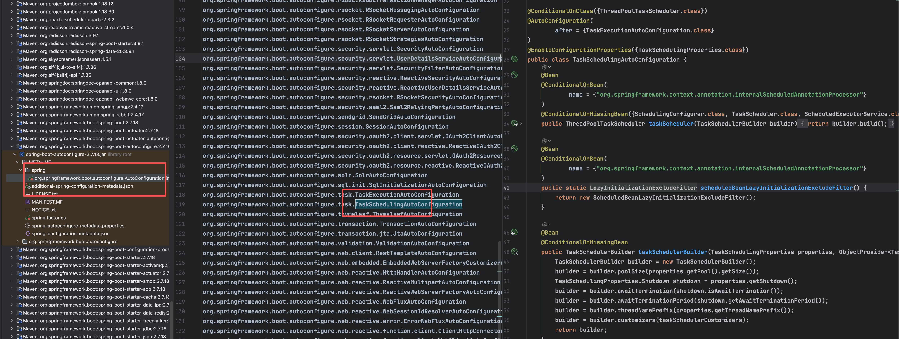

# 类图

[//]: # (![类图]&#40;https://march1995.github.io/uploads/spring/aop/aop类图.png&#41;)

# 一：初始化自动配置(TaskSchedulingAutoConfiguration)



## 若没有自定义配置，则初始化ThreadPoolTaskScheduler.initializeExecutor默认线程池

# 二：初始化流程

## 2.1 @EnableScheduling

```java
@Target({ElementType.TYPE})
@Retention(RetentionPolicy.RUNTIME)
// 导入配置类
@Import({SchedulingConfiguration.class})
@Documented
public @interface EnableScheduling {
}
```

## 2.2 注册核心处理器 ScheduledAnnotationBeanPostProcessor

```java
public class SchedulingConfiguration {
    @Bean(
        name = {"org.springframework.context.annotation.internalScheduledAnnotationProcessor"}
    )
    @Role(2)
    public ScheduledAnnotationBeanPostProcessor scheduledAnnotationProcessor() {
        return new ScheduledAnnotationBeanPostProcessor();
    }
}

```

## 2.3 BeanPostProcessor初始化 注册器：ScheduledTaskRegistrar

### 2.3.1 finishRegistration(完成注册)

注册taskScheduler、Tasks

```java
private void finishRegistration() {
        if (this.scheduler != null) {
            this.registrar.setScheduler(this.scheduler);
        }

        if (this.beanFactory instanceof ListableBeanFactory) {
            Map<String, SchedulingConfigurer> beans = ((ListableBeanFactory)this.beanFactory).getBeansOfType(SchedulingConfigurer.class);
            List<SchedulingConfigurer> configurers = new ArrayList(beans.values());
            AnnotationAwareOrderComparator.sort(configurers);
            
            // 使用用户自定义的SchedulingConfigurer，例如传入一个线程池
            for(SchedulingConfigurer configurer : configurers) {
                configurer.configureTasks(this.registrar);
            }
        }

        // 用户没有自定义的SchedulingConfigurer，就去取 springboot 初始化自动配置的
        if (this.registrar.hasTasks() && this.registrar.getScheduler() == null) {
            Assert.state(this.beanFactory != null, "BeanFactory must be set to find scheduler by type");
            try {
                // 寻找默认的线程池
                this.registrar.setTaskScheduler((TaskScheduler) this.resolveSchedulerBean(this.beanFactory, TaskScheduler.class, false))
            } catch (Exception e) {
                throw new RuntimeException(e);
            }
        }
        this.registrar.afterPropertiesSet();
    }
```

### resolveSchedulerBean

```java
// 寻找默认的线程池
private <T> T resolveSchedulerBean(BeanFactory beanFactory, Class<T> schedulerType, boolean byName) {
        if (byName) {
            T scheduler = (T)beanFactory.getBean("taskScheduler", schedulerType);
            if (this.beanName != null && this.beanFactory instanceof ConfigurableBeanFactory) {
                ((ConfigurableBeanFactory)this.beanFactory).registerDependentBean("taskScheduler", this.beanName);
            }

            return scheduler;
        } else if (beanFactory instanceof AutowireCapableBeanFactory) {
            NamedBeanHolder<T> holder = ((AutowireCapableBeanFactory)beanFactory).resolveNamedBean(schedulerType);
            if (this.beanName != null && beanFactory instanceof ConfigurableBeanFactory) {
                ((ConfigurableBeanFactory)beanFactory).registerDependentBean(holder.getBeanName(), this.beanName);
            }

            return (T)holder.getBeanInstance();
        } else {
            return (T)beanFactory.getBean(schedulerType);
        }
    }
```

# 三：任务扫描与注册

## 3.1 扫描 @Scheduled 方法

```java
// ScheduledAnnotationBeanPostProcessor 核心方法
@Override
public Object postProcessAfterInitialization(Object bean, String beanName) {
    if (bean instanceof AopInfrastructureBean || 
        bean instanceof TaskScheduler || 
        bean instanceof ScheduledExecutorService) {
        return bean;  // 忽略基础设施 Bean
    }
    
    Class<?> targetClass = AopProxyUtils.ultimateTargetClass(bean);
    
    // 6. 扫描目标类中的 @Scheduled 方法
    Map<Method, Set<Scheduled>> annotatedMethods = 
        MethodIntrospector.selectMethods(targetClass,
            (MethodIntrospector.MetadataLookup<Set<Scheduled>>) method -> {
                Set<Scheduled> scheduledAnnotations = AnnotatedElementUtils
                    .getMergedRepeatableAnnotations(method, Scheduled.class, Schedules.class);
                return (!scheduledAnnotations.isEmpty() ? scheduledAnnotations : null);
            });
    
    if (annotatedMethods.isEmpty()) {
        return bean;
    }
    
    // 7. 处理每个标注了 @Scheduled 的方法
    annotatedMethods.forEach((method, scheduledAnnotations) ->
        scheduledAnnotations.forEach(scheduled -> 
            processScheduled(scheduled, method, bean)));
    
    return bean;
}
```

## 3.2 创建并注册任务

```java
// 8. 处理单个定时任务
protected void processScheduled(Scheduled scheduled, Method method, Object bean) {
    try {
        // 创建可执行任务
        Runnable runnable = createRunnable(bean, method);
        
        // 收集所有需要调度的任务
        Set<ScheduledTask> tasks = new LinkedHashSet<>(4);
        
        // 9. 解析 cron 表达式
        String cron = scheduled.cron();
        if (StringUtils.hasText(cron)) {
            String zone = scheduled.zone();
            if (StringUtils.hasText(zone)) {
                tasks.add(this.registrar.scheduleCronTask(
                    new CronTask(runnable, new CronTrigger(cron, timeZone))));
            } else {
                tasks.add(this.registrar.scheduleCronTask(
                    new CronTask(runnable, cron)));
            }
        }
        
        // 10. 处理 fixedDelay（单位：毫秒）
        long fixedDelay = scheduled.fixedDelay();
        if (fixedDelay >= 0) {
            tasks.add(this.registrar.scheduleFixedDelayTask(
                new FixedDelayTask(runnable, fixedDelay, initialDelay)));
        }
        
        // 11. 处理 fixedRate（单位：毫秒）
        long fixedRate = scheduled.fixedRate();
        if (fixedRate >= 0) {
            tasks.add(this.registrar.scheduleFixedRateTask(
                new FixedRateTask(runnable, fixedRate, initialDelay)));
        }
        
        // 保存任务引用
        synchronized (this.scheduledTasks) {
            this.scheduledTasks.put(processedBean, tasks);
        }
        
    } catch (IllegalArgumentException ex) {
        throw new IllegalStateException("Encountered invalid @Scheduled method", ex);
    }
}

// 12. 创建可执行任务
protected Runnable createRunnable(Object target, Method method) {
    Assert.isTrue(method.getParameterCount() == 0, 
        "Only no-arg methods may be annotated with @Scheduled");
    
    Method invocableMethod = AopUtils.selectInvocableMethod(method, target.getClass());
    return new ScheduledMethodRunnable(target, invocableMethod);
}
```

# 四：任务调度执行

## 4.1 调度器配置 ScheduledTaskRegistrar

afterPropertiesSet.scheduleTasks

```java
public class ScheduledTaskRegistrar implements InitializingBean {
    
    private TaskScheduler taskScheduler;
    private ScheduledExecutorService localExecutor;
    
    @Override
    public void afterPropertiesSet() {
        scheduleTasks();
    }
    
    // 14. 初始化调度器
    protected void scheduleTasks() {
        if (this.taskScheduler == null) {
            // 使用默认的线程池调度器
            this.localExecutor = Executors.newSingleThreadScheduledExecutor();
            this.taskScheduler = new ConcurrentTaskScheduler(this.localExecutor);
        }
        
        if (this.triggerTasks != null) {
            this.triggerTasks.forEach(this::scheduleCronTask);
        }
        if (this.cronTasks != null) {
            this.cronTasks.forEach(this::scheduleCronTask);
        }
        if (this.fixedRateTasks != null) {
            this.fixedRateTasks.forEach(this::scheduleFixedRateTask);
        }
        if (this.fixedDelayTasks != null) {
            this.fixedDelayTasks.forEach(this::scheduleFixedDelayTask);
        }
    }
}
```

## 4.2 任务调度实现

```java
// 调度 Cron 任务
public ScheduledTask scheduleCronTask(CronTask task) {
    ScheduledTask scheduledTask = this.unresolvedTasks.remove(task);
    
    if (scheduledTask == null) {
        scheduledTask = new ScheduledTask();
    }
    
    // 16. 使用 TaskScheduler 调度任务
    scheduledTask.future = this.taskScheduler.schedule(
        task.getRunnable(), task.getTrigger());
    
    return scheduledTask;
}

// ThreadPoolTaskScheduler 实际调度
public class ThreadPoolTaskScheduler extends ExecutorConfigurationSupport 
    implements TaskScheduler {
    
    @Override
    public ScheduledFuture<?> schedule(Runnable task, Trigger trigger) {
        ScheduledExecutorService executor = getScheduledExecutor();
        
        try {
            // 包装错误处理
            ErrorHandler errorHandler = this.errorHandler;
            if (errorHandler != null) {
                task = new DelegatingErrorHandlingRunnable(task, errorHandler);
            }
            
            // 18. 使用 ReschedulingRunnable 实现重新调度
            return new ReschedulingRunnable(task, trigger, executor).schedule();
        } catch (RejectedExecutionException ex) {
            throw new TaskRejectedException("Executor did not accept task", ex);
        }
    }
}
```

## 4.3 ReschedulingRunnable 核心实现

```java
// 19. 可重新调度的任务包装器
public class ReschedulingRunnable extends DelegatingErrorHandlingRunnable 
    implements ScheduledFuture<Object> {
    
    private final Trigger trigger;
    private final ScheduledExecutorService executor;
    private ScheduledFuture<?> currentFuture;
    private Date scheduledExecutionTime;
    
    public ScheduledFuture<?> schedule() {
        synchronized (this.triggerContextMonitor) {
            // 20. 计算下次执行时间
            this.scheduledExecutionTime = this.trigger.nextExecutionTime(
                this.triggerContext);
            
            if (this.scheduledExecutionTime == null) {
                return null;  // 没有下次执行时间，任务结束
            }
            
            // 21. 计算延迟时间
            long initialDelay = this.scheduledExecutionTime.getTime() - 
                System.currentTimeMillis();
            
            // 22. 提交任务到线程池
            this.currentFuture = this.executor.schedule(this, initialDelay, 
                TimeUnit.MILLISECONDS);
            
            return this;
        }
    }
    
    @Override
    public void run() {
        Date actualExecutionTime = new Date();
        // 23. 执行实际任务
        super.run();
        
        Date completionTime = new Date();
        
        synchronized (this.triggerContextMonitor) {
            // 24. 更新触发上下文
            this.triggerContext.update(this.scheduledExecutionTime, 
                actualExecutionTime, completionTime);
        }
        
        // 25. 重新调度（关键：实现循环执行）
        if (!this.currentFuture.isCancelled()) {
            schedule();
        }
    }
}
```