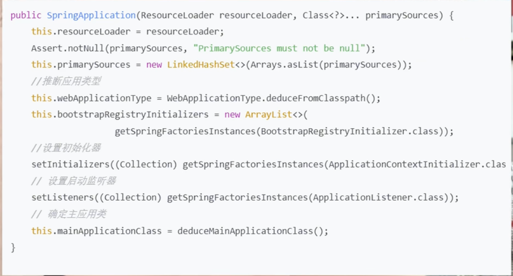

## 主流程

## 1.构造方法

- 1.1 推断应用类型

    判断有没有servlet的类 用于判断是不是web项目

- 1.2 设置初始化器
  
    加载初始化构造器ApplicationContextInitializer,
    触发的springboot的自动配置动作，从spring.factories中加载并实例化指定的类

- 1.3 创建应用监听器

- 1.4 设置应用main()方法所在的类

## 2.启动业务逻辑:

- Headless模式设置
- 加载SpringApplicationRunListeners监听器
- 封装ApplicationArguments对象
- 配置环境模块
- 根据环境信息配置要忽略的bean信息
- Banner配置SpringBoot彩蛋
- 创建ApplicationContext应用上下文
- 加载SpringBootExceptionReporter
- ApplicationContext基本属性配置
- 更新应用上下文

### 2.1总结下run方法中最关键的几步: 准备环境、创建ApplicationContext应用上下文、启动业务逻辑

- 加载SpringApplicationRunListeners监听器
- 配置环境模块:
- 创建ApplicationContext应用上下文
- ApplicationContext基本属性配置
- 更新应用上下文,产生环境所需要的bean, 启动内嵌web服务器
- 调用CommandLineRunner和ApplicationRunner
- 发布allApplicationReadyEvent事件